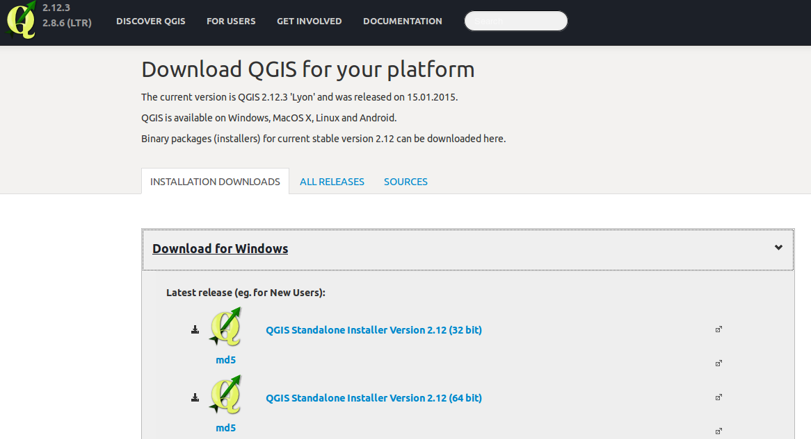
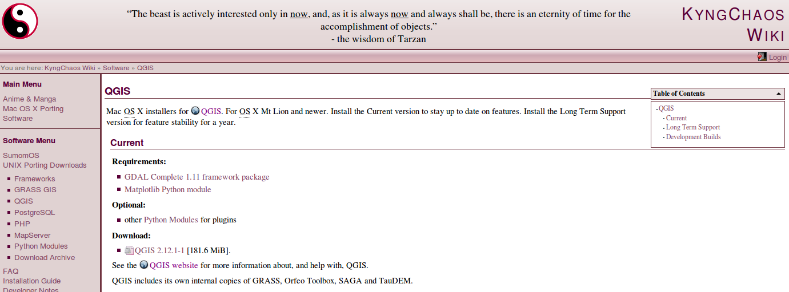

# An Introduction to QGIS

# 1. What is QGIS?

    

[QGIS](http://qgis.org) is an open source GIS (Geographic Information System). In this section we will cover:
* a brief history of QGIS,
* installing QGIS, and
* QGIS and the world of Free and Open Source Software (FOSS) 

## Installing QGIS

While QGIS should already be installed on the machines we are working on, it's worth noting that you can install it on almost any machine for free. So whether you use a Mac or Windows (or even Linux), you can install QGIS on your home computer to do GIS work.

### Installing on Windows

Installing QGIS on a Windows computer is like installing any other piece of software. You download the installer and run it. Download the standalone installer at [download.qgis.org](http://download.qgis.org/).

**The Windows QGIS Installer download page**

### Installing on Mac OS X

Unfortunately, installing QGIS on Mac OS X is slightly more complicated than installing it on a Windows computer. You will need to download and install several packages in the order specified on [KyngChaos](http://www.kyngchaos.com/software/qgis), a popular site that packages open source GIS software for Mac OS X. The packages you need to install are:

* [GDAL](http://www.kyngchaos.com/software/frameworks#gdal_complete) (use the **GDAL Complete** package at the top of this page),
* [NumPy](http://www.kyngchaos.com/software/python) (use the most recent version you can),
* and, finally, [QGIS](http://www.kyngchaos.com/software/qgis) (use the most recent version under **Current**, right now that is 2.12.1-1).

**The Mac OS X QGIS Installer download page**

Rest assured that while the above may sound complicated, you will be successful as long as you download each of the above in order and install them in order. You can always start over if you need to.

## Resources

 * [The QGIS Download page](http://qgis.org/en/site/forusers/download.html)
 * [KyngChaos QGIS OS X installer](http://www.kyngchaos.com/software/qgis)
