# 2. Working with vector data

Like any good GIS, QGIS is capable of opening vector data of numerous file types, manipulating that data, and exporting the data. In this section we will get familiar with how QGIS deals with vector data. We will cover:
 * Opening vector data
   * Including data from databases
 * Selecting data
 * Layers
 * The attribute table
 * Expressions
 * Coordinate Reference Systems
 * Managing projects

## Opening vector data

Here we open common types of vector data sources using a number of methods you will run into.

### Exercise 2-1: Open a shapefile

QGIS will open most vector data files in four ways:
 * the **Add Layer** menu
 * the **Browser Panel** 
 * double-clicking the file
 * dragging-and-dropping the file

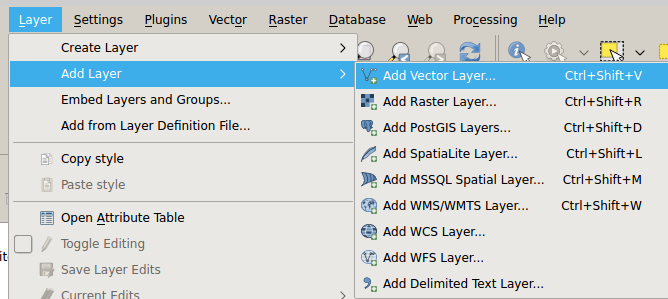
**The Add Layer menu**

In general, QGIS is going to be able to open files that are supported by [OGR](http://gdal.org/1.11/ogr/ogr_formats.html), though this may vary slightly depending on how QGIS was installed.

We recommend adding folders that you commonly use to your favorites in the **browser panel** which should appear on the left side of your QGIS window.

    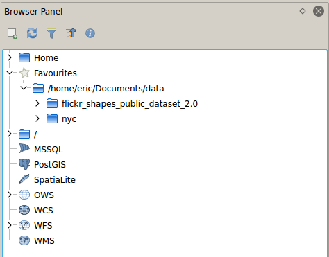

**The Browser Panel**

Let's open a shapefile from NYC Open Data:

 1. Ensure that you have the [Roadbed](https://data.cityofnewyork.us/City-Government/Roadbed/xgwd-7vhd) file on your hard drive.
 2. Open it by going to **Layer > Add Layer > Add Vector Layer** and browsing for it.

Remove the layer from the **Layers Panel** and try opening the file using the other three methods mentioned above (Browser Panel, double-clicking, and drag-and-drop).

### Exercise 2-2: Open a CSV

Here we open a CSV with geographic data in it. When you're opening a CSV with geographic data in its columns, you need to use the **Add Delimited Text Layer** menu. All other methods will ignore the geographic data in the file.

 1. In QGIS go to **Layer > Add Layer > Add Delimited Text Layer**.
 2. Browse for the [Motor Vehicle Collisions 2015](https://data.cityofnewyork.us/Public-Safety/NYPD-Motor-Vehicle-Collisions-2015/kref-x3ki) file and ensure that a valid preview of the file shows up in the bottom of your window, then press **OK**.

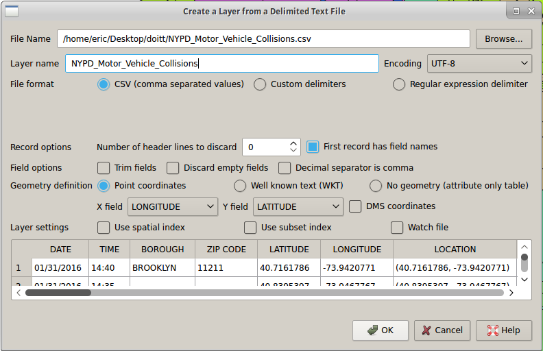
**The Add Delimited Text Layer dialog box**

### Exercise 2-3: Open a WFS layer

Finally, let's load a WFS layer using one of the USGS's public WFS server. The USGS has a set of geologic data sets available [online](https://mrdata.usgs.gov/geology/state/state.php?state=NY), including a WFS version.

 1. Open the [USGS New York geologic map data](https://mrdata.usgs.gov/geology/state/state.php?state=NY) page.
 2. Copy the link to the WFS service, under "OGC WMS".
 3. In QGIS, go to **Layer > Add Layer > Add WFS Layer**.
 4. Create a new connection and paste the WFS link into the URL field.
 5. Select your new connection and press **Connect**.
 6. Select one of the available layers and press **Add**.

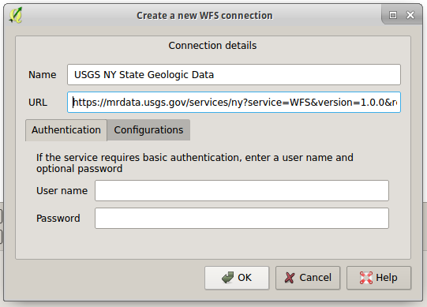
**Adding a new WFS connection**

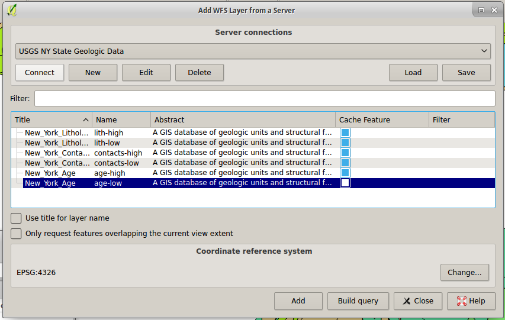
**Adding a WFS layer**

### Exercise 2-4: Loading database layers

We will connect to a publicly accessible PostGIS database that was set up for this workshop:

 1. Go to **Layers > Add Layer > Add PostGIS Layers**.
 2. Create a new connection:
   * host: qgisworkshop.cwxs47o7ilc1.us-west-2.rds.amazonaws.com
   * database: workshop
   * username and password will be provided to you
   * For the purposes of this workshop I recommend saving the username and password for your convenience.
 3. Connect to your new connection and find the available tables by expanding the **public** schema.
 4. Add one of the tables as a layer by selecting it and clicking **Add**.

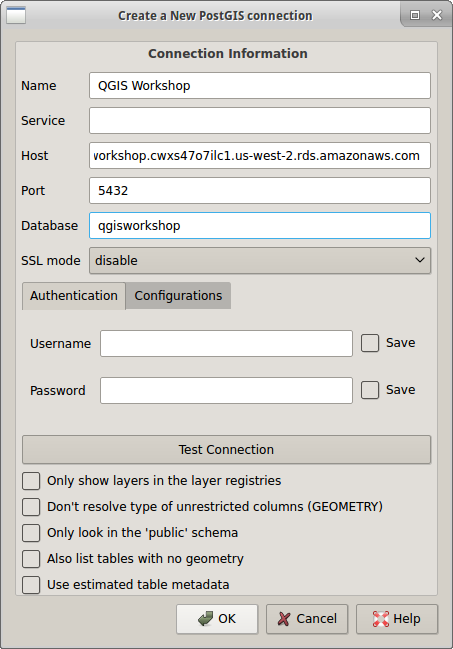
**The Create a New PostGIS Connection dialog**

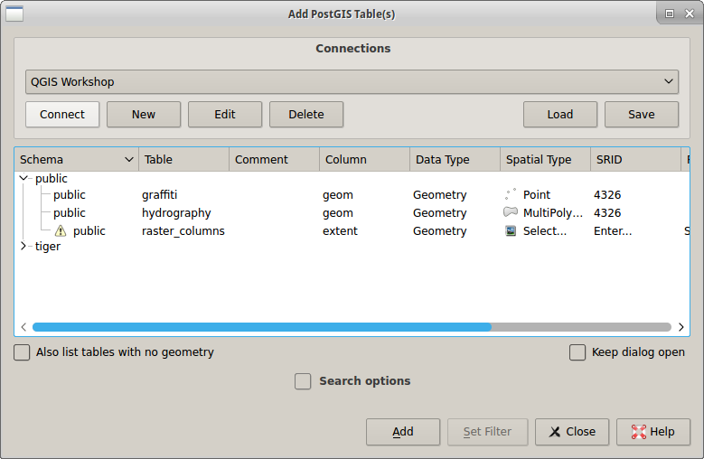
**The Add PostGIS Table dialog**

## Exporting vector data

### Exercise 2-5: Exporting vector data

Similarly to opening vector data, you can export vector data in many of the supported [OGR vector formats](http://gdal.org/1.11/ogr/ogr_formats.html). In order to export vector data it must first be open as a layer in your **layers panel**. Right-click on the layer and select **Save As**, and you will have access to the **Save vector layer as...** dialog.

Once a vector layer is open in QGIS, it doesn't matter what the original file type of the layer was. So converting from any supported file type (or database table) to any other supported file type works exactly the same way.

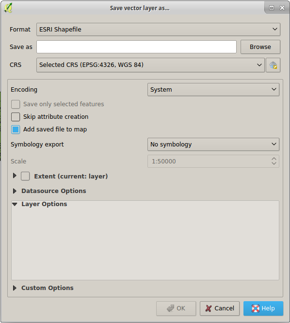
**The "Save vector layer as..." dialog**

 1. Add a layer to your **layers panel** if you don't already have one open. Use one of the layers from the previous exercise.
 2. Right-click on layer in the layers panel.
 3. Select **Save As...**.
 4. Pick a format other than the one the layer was originally in.
 5. Browse to save the file in an appropriate place and press **OK**.

## The Attribute Table

Here we cover common attribute-related tasks:
 * Filtering
 * Selecting
 * Invert selection
 * Move selection to top
 * Query tool
 * Field calculator, adding and converting values

### Exercise 2-6: Filtering and selecting data

 1. Re-open the [Motor Vehicle Collisions 2015](https://data.cityofnewyork.us/Public-Safety/NYPD-Motor-Vehicle-Collisions-2015/kref-x3ki) file in QGIS if it is not open.
 2. With the collisions layer selected in the **layers panel**, find the attribute table icon to open the attribute table. There are two other ways you can do this: right-click the layer and select **Open Attribute Table** or select the layer and go to **Layers > Open Attribute Table**.
 3. With the attribute table open, filter the data:
    1. Click the button at the bottom left that reads **Show All Features**.
    2. Go to **Column Filter > BOROUGH**.
    3. Enter a borough name in all caps (eg *BRONX*).
    4. Press **[Enter]** or the **Apply** button.
 4. The filter only reduces the number of features that appear in the attribute table, not on the map canvas. Let's select features we have filtered to:
    1. Right-click on one of the features in the attribute table.
    2. Select **Select All**.
    3. All of the features in the borough you picked should be highlighted.
 5. Remove your filter:
    1. Click the arrow next to **Advanced Filter (expression)** in the bottom left of the attribute table (where it used to say **Show All Features**).
    2. Select **Show All Features**.
 6. Your selected features are now interspersed with unselected features in the attribute table. If you want all of the selected features to appear together, find the **Move Selection to Top** button and click it.
 7. To the right of the **Move Selection to Top** button is the **Invert Selection** button. Click this to see all the features that did not have the borough you chose in the **BOROUGH** field.
 8. Let's save only the features with our chosen borough:
    1. Press **Invert Selection** again to select only features with your chosen borough in the **BOROUGH** field.
    2. Exit the attribute table by closing it.
    3. Right click on the layer in the **layers panel**.
    4. Select **Save As...**.
    5. Browse for a valid location to save the file to.
    6. Ensure **Save only selected features** is checked.
    7. Press **OK**.
    8. A new layer with just your selected features should be added to your **layers panel**.
 9. Now that we are done filtering and selecting, unselect the features:
    1. Select the original layer in the **layers panel**.
    2. Open the attribute table.
    3. Find the **Unselect All** button to the left of the **Move Selection to Top** button, and click it.

## Expressions

In this section we will use expressions in two ways:
 * Select by expression
 * Field calculator

### Exercise 2-7: Selecting by expression

 1. Re-open the [Motor Vehicle Collisions 2015](https://data.cityofnewyork.us/Public-Safety/NYPD-Motor-Vehicle-Collisions-2015/kref-x3ki) file in QGIS if it is not open.
 2. With the collisions layer selected in the **layers panel**, find and click the **Select by expression** button.
 3. Let's recreate the selection from the previous exercise:
    1. In the middle panel, expand **Fields and Values**.
    2. Double-click **BOROUGH**. This should add **"BOROUGH"** to the text area in the left panel.
    3. Above the left panel, click **=**.
    4. With **BOROUGH** still selected in the middle panel, go to the right panel and press **All unique**.
    5. Double-click one of the resulting borough names. Your left panel should now look something like **"BOROUGH" = 'BRONX'**.
    6. Press **Select**.
 4. Let's select another borough instead:
    1. In the left panel, delete the borough name and the quotation marks around it (eg **'BRONX'**). Leave the cursor after **=**.
    2. In the right panel, double-click a different borough name.
    3. Press **Select**.
 5. Let's add another borough to our selection:
    1. In the left panel, delete the borough name and the quotation marks around it again (eg **'BRONX'**). Leave the cursor after **=**.
    2. In the right panel, double-click a different borough name.
    3. Instead of pressing **Select**, click the arrow next to **Select** and choose **Add to selection**. You should now have crashes in two boroughs selected.
 6. Now select all of the collisions that happened in July:
    1. Delete the previous expression from the left panel.
    2. Expand **Fields and Values** and double-click **DATE**.
    3. Expand **Operators** and double-click **>=**.
    4. After the **>=** in the left panel, type **'07/01/2015'**.
    5. Under **Operators** double-click **AND**.
    6. Under **Fields and Values** double-click **DATE**.
    7. Under **Operators** double-click **<=**.
    8. After the **<=** in the left panel, type **'07/31/2015'**.
    9. Your expression should look like **"DATE" >= '07/01/2015' AND "DATE" <= '07/31/2015'**.
    10. Press **Select**.
 7. Since we know the format of the dates, we can do the same as above by just looking at the first two characters in **DATE**:
    1. Delete the previous expression from the left panel.
    2. Under **String** in the middle panel, double-click **left**, which gets the first *n* characters from the field.
    3. Under **Fields and Values** double-click **DATE**.
    4. In the left panel after **"DATE"**, type **, 2** to specify that we want the first two characters.
    5. Type **)** to close the **left** function.
    6. Type **= '07'** to compare the output of **left** to **07**.
    7. Your expression should look like **left("DATE", 2) = '07'**.
    8. Press **Select**.
    9. Use **Save As...** and save only the selected features. We will be using this in future exercises.

### Exercise 2-8: Using the field calculator

We will add simple columns to a file.
 1. Re-open the [Motor Vehicle Collisions 2015](https://data.cityofnewyork.us/Public-Safety/NYPD-Motor-Vehicle-Collisions-2015/kref-x3ki) file in QGIS if it is not open and select the layer in the **layers panel**.
 2. Find the **Open Field Calculator** button and click it.
 3. Create a new field:
    1. Set **Output field name** to **injuries**.
    2. Leave **Output field type** set to **integer** and **Output field width** set to **10**.
    3. Create an expression that adds **NUMBER OF PEDESTRIANS INJURED**, **NUMBER OF CYCLIST INJURED**, and **NUMBER OF MOTORIST INJURED**.
    4. Press **OK**.
 4. Open the attribute table and confirm that a new field was created named **injuries**.
 5. Confirm that your math was correct by using **Select by expression** to select all features where our new field (**injuries**) is equal to the original field (**NUMBER OF PERSONS INJURED**).

## Coordinate Reference Systems

We will look at three ways of dealing with coordinate reference systems:
 * Project-wide,
 * Setting the layer's projection, and
 * Changing the layer's projection

### Exercise 2-9: Changing a layer's coordinate reference system

 1. Re-open the [Roadbed](https://data.cityofnewyork.us/City-Government/Roadbed/xgwd-7vhd) file in QGIS if it is not open. The layer is currently in **EPSG:4326**. We want the layer to be in **State Plane Long Island** (**EPSG:2263**) to do some geoprocessing with another layer.
 2. Right-click on the layer in the **layers panel**.
 3. Choose **Save As...**.
 4. Select **ESRI Shapefile** for the format.
 5. Click **Browse** and choose a valid location for the shapefile. We recommend ending the filename with **_2263**.
 6. Next to the **CRS** dropdown, click the **Select CRS** button.
 7. In the **Coordinate Reference System Selector** dialog, type **2263** in the **Filter** field to find **NAD83 / New York Long Island (ftUS)**. Click it to select it, then press **OK**.
 8. Press **OK** back in the **Save vector layer as...** dialog.
 9. A new layer with the selected CRS should be added to your **layers panel** in addition to the old layer.

### Exercise 2-10: Correcting a layer's coordinate reference system

Here we intentionally load a layer in the wrong coordinate reference system and fix it:
 1. Open [7 Major Felony Incidents](https://data.cityofnewyork.us/Public-Safety/NYPD-7-Major-Felony-Incidents/hyij-8hr7).
 2. Using the **Add a Delimited Text Layer** dialog, browse for the felonies file.
 3. Confirm that:
    1. **Geometry definition** is set to **Point coordinates**.
    2. **X field** is set to **Xcoordinate**.
    3. **Y field** is set to **Ycoordinate**.
 4. Press **OK**.
 5. If prompted to select a CRS choose **EPSG:4326**. QGIS should default to this.
 6. The file is actually in **State Plane Long Island** (**EPSG:2263**). You can confirm this by opening another layer in NYC and zooming to the layer's extents--they will not overlap correctly.
 7. Let's fix the felonies layer's CRS:
    1. Double-click on the layer in the **layers panel**.
    2. Go to the **General** tab.
    3. Under **Coordinate reference system**, find and click the **Select CRS** button (to the right of the CRS dropdown).
    4. Filter the CRSs by typing **2263** in the **Filter** field. Select the correct CRS and press **OK**.
    5. Press **OK** to apply your changes to the layer's properties.
 8. Once the points redraw, they should now overlap correctly with other NYC data.

## Managing projects

### Exercise 2-11: Handling lost data

 1. Open a layer in QGIS if you do not have any open currently.
 2. Save the project by going to **Project > Save**.
 3. Close QGIS.
 4. Open the project by double-clicking it. Ensure that the project loads as expected.
 5. Close QGIS again.
 6. Move one of the project's data files on your computer to another folder on your computer. For example, if one of the project's layers is a shapefile, move all of the files in that shapefile (or the folder they are in) somewhere else.
 7. Open the project again by double-clicking it.
 8. Use the **Handle bad layers** dialog to fix the data file's location:
    1. Select the layer.
    2. Click **Browse**.
    3. Find the layer on your computer.
    4. Click **OK**.
 9. If this was successful, the project should now open exactly as it was before.

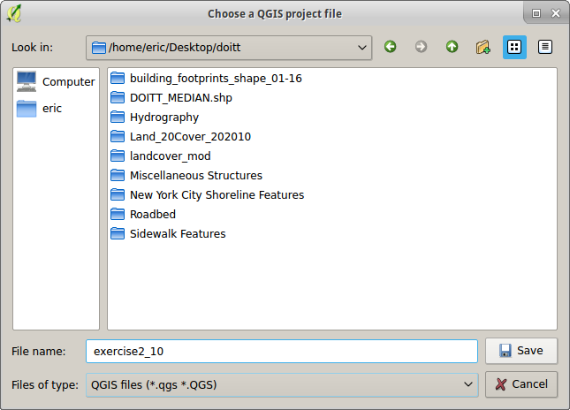
**The Save Project dialog box**

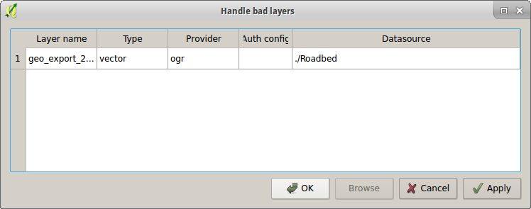
**The Handle Bad Layers dialog box**

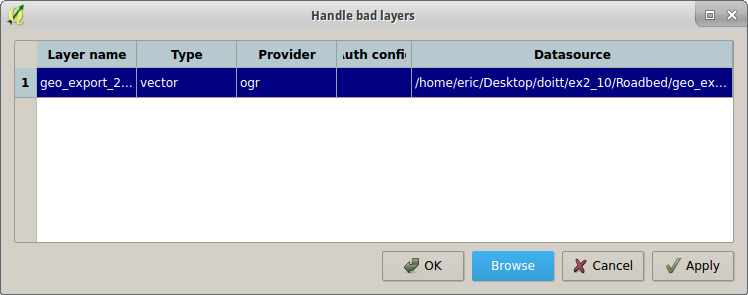
**The Handle Bad Layers dialog box with the layer's new location set**

## Resources

 * [QGIS: Attribute Tables and Selecting Features](https://www.youtube.com/watch?v=Fm6bjyijamk) (video)
 * [QGIS: Working with Projections](https://www.youtube.com/watch?v=iOhhFIIOb08) (video)

